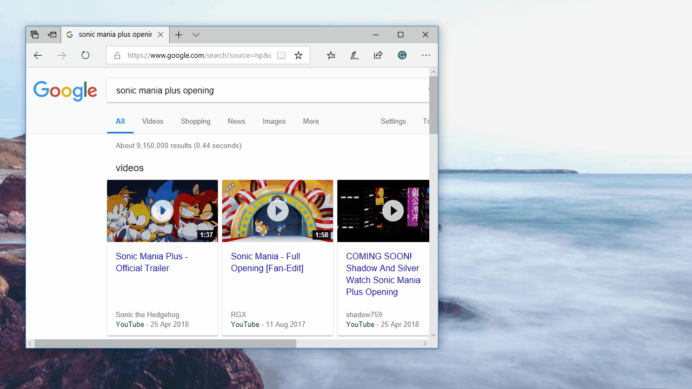

# Youtube-App-Launcher-UWP
A UWP app that Opens YouTube links, parses the Video ID out of them, then uses the Video ID to launch other Windows 10 YouTube apps using their URI schemes and play the video on those apps. While there are browser extensions that help with this problem already, this also works from Windows programs and apps too!

Need help or have questions? Contact me at colinkiama@gmail.com
